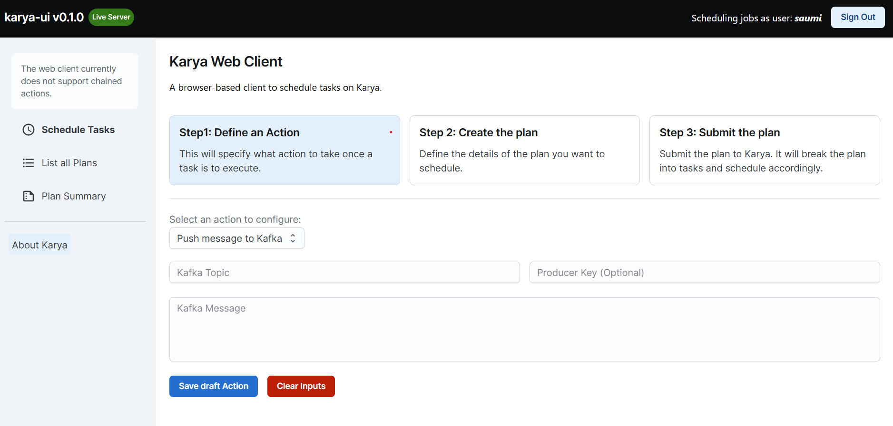
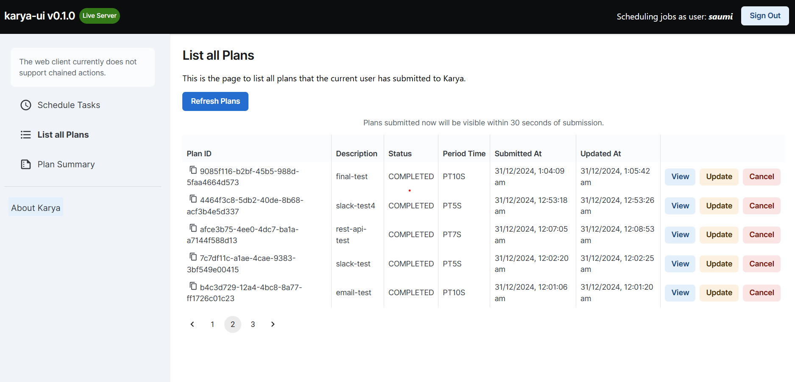
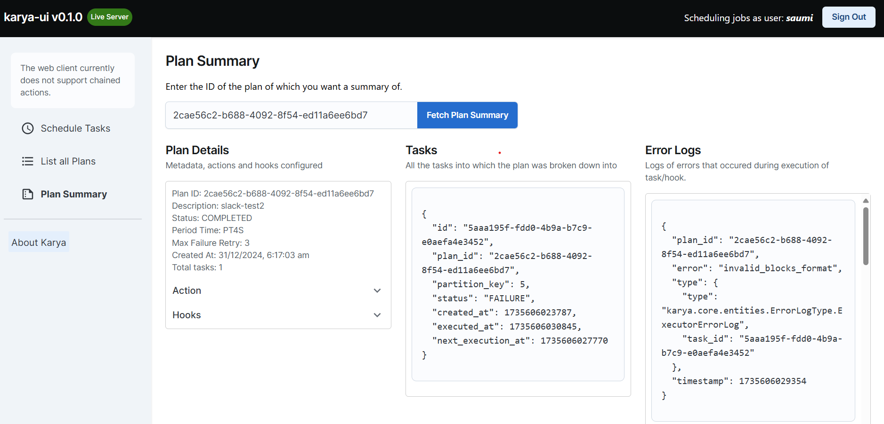
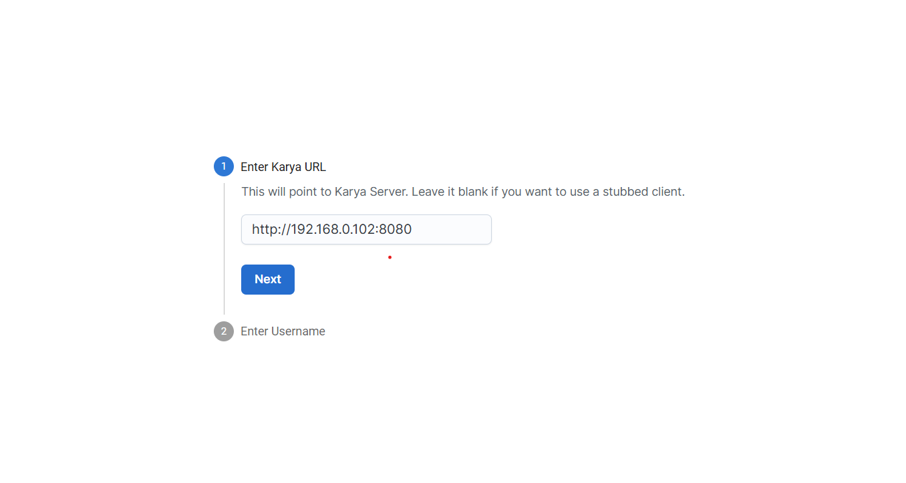

# karya-ui
Browser-based UI to interact with [Karya](https://github.com/Saumya-Bhatt/karya) the distributed task execution framework.

**NOTE: WEB-UI CURRENTLY DOES NOT SUPPORT SCHEDULING CHAINED PLANS**

**Demo:** [https://saumya-bhatt.github.io/karya-ui/](https://saumya-bhatt.github.io/karya-ui/)

> Leave the Endpoint Blank to view the interface with stubbed responses.

## Screenshots

### Scheduling Plans



### List all Plans



### View Plan Summary



## Quick Start

1. Run the docker container using the following command:

    ```shell
    docker run -d --name karya-ui -p 5001:5000 karya-ui
    ```

2. Open the browser and navigate to `http://localhost:5001`
3. On the login page, provide the URL where the Karya server is running and enter a username (if not already registered, a new user will be created)



And you're good to go!

> **Note**: Leave the URL field empty to use a stubbed client to test the UI
